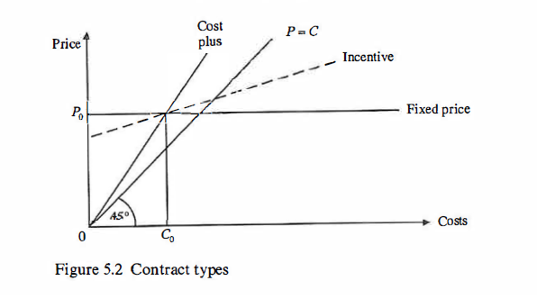
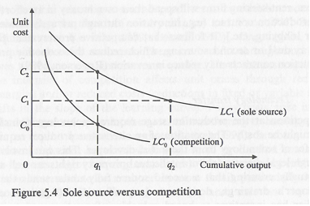
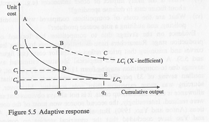

# Procurement: theories, evidence and policies

The procurement of defense equipment is big business. Expenditure
procurement in 1992 accounted for between 17 and 22 percent of total
military expenditure for European NATO and USA, respectively
[@Sipri_1993]. These share figures nations major weapons procurement
only, so under-stating real arms procurement expenditure. In the UK, for
example, in the early 1990s expenditure on equipment accounted for about
40 percent of defense spending.

Critics of defense equipment procurement policies point to the high
costs of weapons, cost escalation, delays in delivery, deficiencies in
performance, poor reliability, and cancellations of costly projects.
Contractors are further criticized with allegations of excessive
profits, waste, fraud, and inefficiency [@Austin_1992; @Spear_1990].
Such criticisms immediately raise a methodological problem:What are the
criteria for assessing procurement policy and defense contracting? Is it
assumed that the ideal contract type is one of a perfect project which
encounters no technical, cost or time problems? Or are comparisons being
made with actual previous project experience within a country or in
other countries?

This chapter reviews the literature on the various types of defense
contracts and competitive procurement. Decisions to buy defense
equipment are reflected in the award of a contract whereby a supplier
provides a product or service of a specified quality over some time
period in return for an agreed payment. This description simplifies the
problems reflected in the transaction costs of acquiring information
about products and suppliers, organizing competitions, bargaining with
contractors, and then writing, monitoring, and enforcing contracts.
Contracting requires the government as a buyer or principal to specify
its requirements to the a contractor or agent, and to ensure that the
agent pursues the goals of principal. Contracts which cannot specify all
the details of a buyer's requirements provide the contractor with
opportunities for discretionary writing, behaviour (e.g., pursuing
managerial preferences). Similarly, monitoring, and enforcing contracts
requires outputs to be specified in measurable form. However, the
incentives and penalties incorporated into the contract will affect the
behaviour of agents: individuals and groups can play any games and the
results might be unexpected and undesirable. The chapter starts by
reviewing the traditional approach to defense contracting; and it then
considers the literature on cost-estimating relationships and various
types of contracts including the more recent theoretical developments.
Throughout the survey, there will be a recent focus on the features of
the market within which contracting takes place, the behaviour of
agents, including contractors, and their response to different
contractual incentives and regulatory constraints. Competitive
procurement policies are then evaluated. The opportunities for
competition are assessed and consideration is given to its benefits and
costs.

## Market Failure

At one level, defense equipment markets are like any other market: they
bring together buyers and sellers [@hooper1991defence]. National defense
ministries and their-armed forces as well as overseas governments demand
defense equipment. On the supply side, defense industries both
nationally and overseas, provide equipment. And the demand and supply
sides are brought together through a legally binding contract whereby
the buyer agrees to pay a certain price for specified product delivered
on time. In some instances, the government a as the buyer might impose
regulatory requirements on the contractor (e.g. profit controls). Figure
5.1 illustrates the market situation with an example from the UK.

Defense equipment markets, however, have some distinguishing features
concerning the role of governments, cost trends, technical progress,
cost curves, and regulation [@Peck1963TheWA]:

1.  Governments are central to understanding defense equipment markets.
    Where it is a monopsonist, a government determines technical
    progress through its choice of equipment and it sole choose whether
    to import or buy from its domestic industry. As can the tanks,
    warships), it can determine the size of its domestic defense or
    major buyer (e.g. combat aircraft, missiles, submarines, efficiency,
    and ownership. In this context, the view has been industry, its
    structure, entry and exit, prices, exports, profits, instrument
    expressed that defense ministry purchasing should be used
    interventionist "key" technologies and to back "the winners" to
    support of national industrial policy, awarding contracts as an
    industrial policy). Supporters of free markets (e.g., Austrian
    economists) are critical, stressing that the future is uncertain and
    that there are unintended secondary effects, so that today's winners
    might be tomorrow's losers; and that governments have no competence
    as entrepreneurs. Interestingly, public choice analysis also
    predicts that governments can fail in their efforts to improve
    economic performance. Furthermore, using defense procurement as an
    instrument of industrial policy raises fundamental questions about
    the objectives of defense policy. Is defense procurement aimed at
    the efficient purchasing of equipment for national defense or the
    pursuit of wider economic and social objectives, including
    protection of the national defense industrial base [@Faltas_1986;
    @Taylor_1989] (see also chapter 7)?
2.  Defense equipment, especially high technology equipment, is costly
    and the trends are toward rising costs in real terms. The American
    B2 stealth bomber was estimated to cost \$35 billion for fifteen
    aircraft and the US F-22 advanced tactical fighter aircraft is
    likely new to cost some \$130 million per copy (1991-2 prices).
    Similarly, equipment is much costlier than the previous generations
    which it replaces (although the new equipment is more productive).
    Typically real unit production costs of defense increase equipment
    (aircraft, helicopters, missiles, warships, submarines) increase by
    about 10 percent per annum, implying a doubling in cost to every
    7.25 such years [@Pugh_1993]. Since defense budgets fail to match
    such cost increases there are inevitable downward pressures on size
    and formation of armed forces with an associated need to reshape the
    defense industries which supply the forces (e.g., the long-run trend
    towards a one-ship navy and a one-aircraft air force). Not
    surprisingly, faced with such pressures, efforts are made to
    introduce new procurement policies, such as competition policy,
    which might at least postpone some of the adjustment effects
    [@Pugh_1993].
3.  Technical progress has been a distinctive feature of defense
    equipment markets. Major technical advances resulting in new
    products (e.g. jet engines, missiles, electronics, helicopters,
    etc.), have created new markets requiring firms to offer new
    development and production facilities with a greater emphasis on
    research and development (R & D). Since 1945, the long-run trend has
    been towards a smaller number of larger firms, reflected in mergers
    and exits from the defense sector. As a result, the high technology
    sectors (e.g. aerospace, avionics) usually consist of one or a
    relatively few large national suppliers either publicly or privately
    owned (monopoly or oligopoly). Such markets are a major departure
    from the economists' model of perfect competition. The cuts in
    defense spending in the USA, UK, and elsewhere in the EU during the
    1990s are likely to reinforce the trend towards exits from the
    industry and restructuring around an even smaller number of large
    defense contractors. As a result, EU states will only be able to
    maintain competition by opening up their national markets to foreign
    suppliers.
4.  A number of defense industries, particularly the high technology
    sectors, are characterized by decreasing costs: hence, if the aim is
    to exploit scale economies, a national market will only support one
    firm of (monopoly). In such sectors, quantity is a major determinant
    unit costs and hence competitiveness. Long production runs volume
    mean that high fixed R & D costs can be spread over a larger and, in
    addition, there are scale and learning economies in production
    [@Bittleston_1990] (see also section 5.4).
5.  Defense markets and industries are government regulated. Governments
    can determine whether their national markets should be open or
    closed, they can insist upon monitoring costs, and there is often
    stage regulation of profits on defence contracts). Typically, the
    aim of of profit controls is to ensure that defence contractors are
    not making excessive profits or excessive losses on defense
    business; and the prevention of excessive losses is designed to
    retain a domestic industrial base. As a results profits on defence
    work might not provide the standard signalling mechanism for entry
    or exit. Moreover, profit-conscious firms are likely to adapt to
    regulatory constraints. For example where profits are controlled
    firms are likely to increase expenditure of unregulated items which
    give satisfaction to their managers (e.g., luxury offices, company
    cars, hoarding scientists and engineers: [@Tisdell_1981]).

## Demand: procurement policy

Procurement policy represents the demand side of the defense equipment
market. involves a set of related choices, with defense contracts as one
element the choice set:

1.  The choice of equipment required for the armed forces with
    implications for technical progress. This involves choosing between
    competing demands from each of the armed forces for a larger share
    of a limited defense budget. In principle, such choices need to be
    made in relation to the nation's security requirements, regardless
    of the traditional monopoly property rights of each of the services.
    For example, why not allow the army with its land-based missiles to
    compete with the air force and its manned combat aircraft for a
    nation's air defense (similarly aircraft versus warships)? In
    reality, such decisions are often made on the principle of Buggin's
    Turn. Last year, the navy obtained its new aircraft carrier; this
    year it is the turn of the air force to receive its new fighter
    aircraft; next year, the army can have a new tank!
2.  The choice of contractor. A contractor has to be selected either
    based by direct negotiation with a preferred supplier or by
    competition based on price and non-price criteria, with the market
    restricted to domestic firms or open to foreign suppliers. Public
    choice analysis predicts that domestic firms will oppose opening the
    national market to foreign suppliers: they will lobby vote-sensitive
    governments claiming that relying on foreigners will impair national
    security and will mean and will mean the loss of jobs, technology,
    and valuable foreign exchange (depending on whether the exchange
    rate is viewed as a policy objective or policy instrument).
    Economists can critically appraise such arguments pointing to the
    costs national independence (protection); showing that there are
    alternative and often more efficient methods of achieving jobs,
    technology and other policy objectives; and raising questions as to
    whether the aims of defense procurement policy are to protect the
    nations citizens or its domestic defence industries (who is
    maximising what benefit for of whom? (Hartley, 1991a,b)).
3.  The choice of of contract. A contract has to be selected from the
    extremes of firm or fixed-price contracts, a cost-plus the some firm
    intermediate target cost-incentive sharing arrangement. With a firm
    price contract, the firm receives the contract price, no more and no
    less. Fixed-price contracts allow for variations of price based on
    agreed price index reflecting inflation in labour and material price
    contract inputs. Where a prime contractor receives a fixed-price
    contract (with agreed price variations), it has every incentive to
    negotiate firm prices with its suppliers, so that the prime
    contractor appropriates all the financial benefits of price
    variations. An alternative solution would be to award competitively
    determined firm price contracts, leaving contractors to make their
    own judgements about future inflation, incorporating such estimates
    own their tender bid. Of course, another solution is to award a
    cost-plus in contract the in which the contractor recoups all its
    costs incurred project plus an agreed profit rate based on costs or
    with a fixed on fee. Such contracts are used for development work
    where there might be considerable uncertainty. Not surprisingly,
    these "blank cheque" contracts lead to inefficiency, labour
    hoarding, cost escalation and "gold-plating" (Scherer, 1964;
    Kennedy, 1983). A comparison of firm price and cost-plus contracts
    identifies two policy issues. First, how should the risks of the
    program be distributed between the state (buyer) and the contractor?
    Second, what are the implications of different contractual
    arrangements for firm behaviour and efficiency, and for efficiently
    meeting the buyer's requirements. Of course, it is not always
    possible for the buyer (defense ministry) to specify in advance all
    its detailed requirements: hence, it might prefer a contract which
    allows it some discretion to modify its requirements. But, once the
    contract has been awarded, any contract modifications have to be
    negotiated with the monopoly contractor.
4.  The incentives to choose. Ultimately, efficient solutions depend
    upon the set of incentives and penalties incorporated into the
    employment contracts of procurement staff in the armed forces and
    defense ministries. Often individuals and groups in the armed forces
    and defense ministries have every incentive to spend: there are no
    inducements to economize if all the savings by, say, the navy are
    used to by more tanks for the army, or they eventually benefit the
    national Treasury.
5.  How are choices made? Within any procurement organization, equipment
    choices will often be made by a committee. Clearly, the size of
    committee, its objectives, the composition of its membership, the
    conditions of entry and exit, the background of the chairman and the
    voting arrangements are central to determining actual procurement
    choices.

Consideration of the choices and organizational arrangements outlined
above are usually ignored or neglected by economists. This is not
surprising since economists have often regarded governments as a "black
box" which always pursues the "will of the people". Such an approach
ignores the insights provided by public choice analysis which applies
the neo-classical concepts of exchange and self interest to the
political market place of voters, parties, governments, bureaucracies,
and interest groups; and also ignores the fact that in defense the "will
of the people" is not always apparent (so providing governments and
defense ministries with opportunities for discretionary behaviour
(Buchanan, 1986)).

Public choice analysis provides two predictions of relevance to defense
contracting and procurement policy. First, government policies tend to
favour producers more than consumers. Second, budget-maximizing
bureaucracies will be inefficient: their budgets will be too large as
they exaggerate the demand for their services and underestimate the
costs of their preferred activities (eg, exaggerating the threat;
resulting in cost escalation on equipment projects (Hartley, 1991b,
chapter 5; Dunleavy,1991; Mayer, 1991)\].

In evaluating procurement policy, economists have traditionally applied
their standard economic models of free trade and competition, including
the opportunities for competitive bidding at various stages in a
project's life cycle. Here, many of the pioneering contributions in the
microeconomics of defense emerged in the 1960s and were made by American
economists, with the Rand Corporation in the forefront. The Classic text
by Hitch and McKean devoted a short section to defense contracting
(Hitch and McKean, 1960, pp. 223-33).

## Competition, firm behavior, bargaining, and contract types

One of the early definitive economic texts in this field is The Weapons
Acquisition Process: Economic Incentives (Scherer, 1964). This provides
benchmark and sets the scene for assessing the subsequent theoretical,
empirical, and policy developments in defence contracting. The book
starts by outlining four features of the weapons acquisition process.
First, development work is characterized by uncertainty and risk often
resulting in the shifting of financial risks from contractors to
government usually through cost-reimbursement contracts. Second, once a
project starts, the contractor acquires specialized information and
physical assets which restricts the government's ability to shop around
and bring in an alternative contractor. The result is a bilateral
monopoly bargaining situation. Third, these features of the weapons
acquisition process mean that a conventional market system is not
possible: hence, the reliance on a non market, quasi-administrative
buyer-seller relationship. Fourth, in the absence of market forces,
successful weapons acquisition requires governments to intervene either
through controls on contractors or through incentive mechanisms to
reward good performance and penalize poor performance. Of course, to be
effective, contractors have to believe that incentive and penalty
arrangements will be enforced by the government's procurement agency.
Incentives can be either competitive or contractual.

Competitive bidding for production contacts has been achieved via
breakout and second sourcing. By the early 1960s US evidence appeared to
show that competitive break-outs[^ch5_procurement-1] resulted in price
reductions of 20 percent compared with prices negotiated non
competitively. However breakouts and competitive bidding involves costs
in preparing manufacturing information at specifications, in maintaining
quality, and in disputes about transferring private property rights
(proprietary data). Problems also arise where the original contractor
possesses immobile specialized facilities. Price competition can also be
achieved through second sourcing where one or more firms are selected to
produce a weapon system (or subsystem concurrently with the original
contractor. Second sourcing was used extensively during World War II and
the Korean War (often for reasons other than competition). A subsequent
example of second souring involved the US Navy's Sidewinder program.
Sharing the production work between Philco (the original contractor) and
General Electric (second source) on the basis of each firm's success in
reducing costs resulted in the price per unit falling to one seventh of
its initial price (although the price reductions also reflected learning
curve effects based on a 76 percent progress curve (Scherer, 1964, pp.
118-19)). But as with break-out competition, second sourcing is not
costless. Also, where learning economies are important, the original
producer may have a decisive cost advantage over a new entrant. Or,
where economies of scale are substantial, and the production order will
support only one firm of optimal scale, it is inefficient to share an
order between two firms (Scherer, 1964, p. 127). In addition to
competition, contractual incentives can be used to monitor and police
contractors.

[^ch5_procurement-1]: Break-outs can involve no competition with
    government buying part directly for subcontractors; or
    subcontractors can enter into competitive bidding; or the compete
    production contract can be subject to competitive bidding.

Agreement on a defense contract for development and/or production work,
will reflect the preferences of the government's procurement agency and
the contractor. Governments will aim to maximize contractor efficiency
incentives, minimize the risk of excessive profits paid to contractors
and minimize contract outlays. With fixed-price contracts, there are
conflicts between contractor efficiency incentives and the risk of
excessive profits; whereas cost reimbursement contracts minimize the
risk of excessive profits but at the price of removing contractor
efficiency incentives and also of requiring stringent accounting and
reporting requirements. Incentive contracts offer a compromise solution
between the various competing goals of contractor efficiency,
profitability, and contract outlays. However, governments must reach an
agreement with a contractor on the type of contract to be written for a
procurement decision. Here, contractors will pursue conflicting
objectives concerned with profit maximization and minimizing the risk of
contract failure and losses (Scherer, 1964, chapter 6). The various
objectives and preferences of the buyer and the contractor have to be
reconciled in a bargaining situation.

In negotiating a contract, the final Outcome Will reflect the bargaining
power of the two parties, as well as their bargaining strategies and
tactics. Clearly, contractors have every incentive to negotiate
favourable cost and price targets: on cost-sharing arrangements, they
will seek to shift the risks of cost overruns to the government; and
where the government demands a maximum price liability, the contractor
will seek the highest possible maximum price. A contractor's knowledge
of costs gives them a major advantage over the buyer in the bargaining
process. Demands by the government fo access to a contractor's
accounting data will always be resisted an even where granted,
accounting information is historical and does not indicate the extent of
contractor inefficiency. However, the government is not powerless. It
can use competition from either national or foreign firms to check on a
contractor's price bid. But even where contract are based on "keen"
competitive prices, there might be some incompleteness" in the contract,
enabling contractors to make cost quality trade-offs (Scherer, 1964,
chapter 8).

## Cost-estimating relationships

Industry and defence procurement agencies use various method to estimate
the development and production costs for large equipment projects (e.g.,
aircraft, helicopters, tanks, warships). Such estimates are used in the
initial planning phase for new equipment projects (eg, for use in a
defense ministry's long-term costings); or as a basis for a firm's bid
for a new project; and as a check by defense procurement agencies on the
cost estimates submitted by firms. For example, defense ministry cost
estimates have been used to identify the cost savings which have
resulted from competition although some of the claimed savings could
reflect poor estimating!

Typically, early estimates of the development and production costs for
an advanced technology defense project are unreliable. American and
British studies show that projects usually increased in real cost by
some 40-70 percent from their earliest estimates to completion (MoD,
1988; Pugh, 1993; Perry et al., 1971). Such cost escalation results from
modifications and changes in requirements, technical uncertainties
making it difficult to define the work to be done and contractor
optimism reflected in low bids (Martin et al., 1992). Also, governments
often believe that costs will be lowest when a contract is awarded to
the firm whose initial estimate or bid is lowest. However, it is
possible that low estimates in themselves create conditions that
contribute to cost escalation; and there is some limited support for
this hypothesis (Large, 1974). In the circumstances, it needs to be
recognized that early cost estimates are notoriously unreliable: a
situation which requires either better estimating techniques and/or
alternative procurement policies (e.g. competitive fixed-price contracts
for development work). Here, though, some analysts have recommended
caution. It has been suggested that no single procurement method or
acquisition strategy can possibly serve for all situations. Whilst
incremental development or prototyping are appropriate in some
circumstances neither should be recommended as universal practice
(Martin et al., 1992 p. 72).

The methods used to estimate costs include: 1. Engineering estimates 2.
Comparative methods 3. Parametric methods 4. Learning curves

### Engineering estimates

Engineerig estimates are based on the estimated costs of all the
materials, equipment, components, labour, and overheads involved in the
project (Fox, 1974; Sissons, 1986). Comparative methods are based on
historical comparisons of similar projects (e.g, combat aircraft;
transport aircraft). For example, on UK combat aircraft development
work, graphs of the relationship between technical man hours per pound
of empty weight and the date of start show a positive and increasing
trend over time: hence the launch costs for a 1970 combat aircraft were
some fifteen times greater than that of a 1930s combat aircraft (Boot,
1990,p. 213). Rules of thumb are also used. For example, on UK guided
weapons a typical ratio of development cost to unit production cost
might be 1,000:1; for combat aircraft with an existing engine, the
corresponding ratio might be 100:1; and for warships the ratio is under
1:1 \[based on 1,000 guided weapons; 100 aircraft, respectively (Pugh,
1986, p. 346)\]. Similarly, rules of thumb might be used to estimate
lifecycle costs comprising acquisition and ownership costs (i.e., R&D,
production, operating, maintenance, and disposal costs). UK evidence
suggests that on warships, development and procurement account for 25
percent of life cycle costs whilst for combat aircraft the corresponding
share might be 13 percent \[based on six ships in a class over
twenty-five years; 250 aircraft produced over twenty-five years (Pugh,
1986, p. 124)\]. But, of course, rules of thumb and extrapolation based
on past relationships might need to be adjusted to allow for variations
in the complexity of new programs compared with "typical" projects.

### Comparative Methods

Comparative methods are based on historical comparisons of similar
projects (c.g., combat aircraft; transport aircraft). For example, on UK
combat aircraft development work, graphs of the relationship between
technical man hours per pound of empty weight and the date of start show
a positive and increasing trend over time: hence the launch costs for a
1970 combat aircraft were some fifteen times greater than that of a
1930s combat aircraft (Boot, 1990, p. 213). Rules of thumb are also
used. For example, on UK guided weapons a typical ratio of development
cost to unit production cost might be 1,000:1; for combat aircraft with
an existing engine, the corresponding ratio might be 100:1; and for
warships the ratio is under 1:1 \[based on 1,000 guided weapons; 100
aircraft, respectively (Pugh, 1986, p. 346)\]. Similarly, rules of thumb
might be used to estimate life-cycle costs comprising acquisition and
ownership costs (i.e., R & D, production, operating, maintenance, and
disposal costs). UK evidence suggests that on warships, development and
procurement account for 25 percent of life cycle costs whilst for combat
aircraft the corresponding share might be 13 percent \[based on six
ships in a class over twenty-five years; 250 aircraft produced over
twenty-five years (Pugh, 1986, p. 124)). But, of course, rules of thumb
and extrapolation based on past relationships might need to be adjusted
to allow for variations in the complexity of new programs compared with
"typical" projects.\]

### Parametric methods

Methodologies also exist for forecasting future R & D project costs.
These are often based on the cost profiles of historical R & D project
data which map the relationship between the cumulative proportion of
both project costs and project time. Typically, project R&D costs are
front loaded, rising steeply toward the midpoint of the system
development project, then falling steeply with production beginning
about half way through the program. Cavin (1991) has formulated an
optimal control model of new weapon system development which is broadly
consistent with the empirical data.

Parametric methods are based on multiple regression analysis and have
been widely used, particularly for estimating the development and
production costs of aerospace equipment. Much of the published work in
this field has emerged from the US Rand Corporation. Typically,
log-linear equations are used in which engineering and manufacturing
hours are estimated as a function of aircraft weight, speed, and the
number of aircraft produced (Elstub, 1969). A Rand study based on a
limited post-1960 sample of US military aircraft found that the most
accurate cost-Estimating relationships (as exponential equations) were
based as empty weight and speed. Incorporating additional variables for
program structure and airframe construction characteristics (eg. wing
type, number of black boxes, contractor experience) did not improve the
overall fit of the equations (Hess and Romanoff, 1987). However, it was
recognised that the Rand equations might not be applicable for
estimating the costs of future aircraft. Changes in airframe materials
(E.g composites), design concepts (e.g., stealth), systems integration,
and manufacturing techniques are likely to affect the reliability of
conventional cost-estimating relationships (Hess and Romanoff, 1987).
Similar models have also been developed for estimating the cost changes
in US Navy ship-building programs. These statistical models show that
man hours per ship depend on such variables as the number of workers,
the average daily hours worked, the experience and skill level of labour
force, the ship construction sequence, the labour input applied to other
programs, and delays in ship delivery. In its log-linear form, the model
explained 94 percent to 99 percent of the variations in man hours ship,
with learning curves of 78-88 percent for two programs (Hammond and
Graham, 1983).

### Learning Curves

Learning curves apply to production programs, and are widely used by
governments and industry for cost-estimating and contract negotiations.
They reflect the fact that productivity increases with experience.
(hence they have been called experience curves) and they provide a basis
for estimating manufacturing costs. Learning curves are usually
expressed:

y = aX\^-b where y = number of man hours per unit produced, a = man
hours required for the first unit, b = slope of the learning curve
usually defined in relation to a doubling of cumulative output.

Although originally estimated for the aircraft industry and widely used
throughout the world's aerospace industries, learning curves also apply
to a range of defense equipment and to civil products such as electrical
appliances, machine tools, petroleum refining, and steel industries. An
80 percent learning curve, which is often used in aircraft manufacture,
indicates that direct labour inputs decline by 20 percent for each
doubling of the cumulative output of a given aircraft (Asher, 1956;
Hartley, 1969).

A distinction can be made between unit and cumulative average learning
curves with the unit curve referring to the man hours required for the
nth unit (marginal), whilst the cumulative average refers to the average
time required to produce a total of n units. Both unit and cumulative
average curves can have 80 percent slopes and, after an initial output
has been produced, they become parallel in their log-linear form
(Sissons, 1986,. 89).

Examples of labour learning curves based on European experience for a
variety of defense equipment are shown in table 5.1. The slopes of the
curves range between 75 percent and 96 percent, with a median slope of
85 percent to 90 percent. There is evidence of a limit to learning,
especially for warships, where the limit occurs between four and twelve
units. Even where learning is continuous, it is often assumed that the
curve tends to flatten out with greater output. However, learning curves
are not unit cost curves. The effect of labour learning on unit
production costs will depend on the share of labour costs in total
production costs. On aircraft, for example, labour can represent 30-50
percent of total costs; for helicopters, the labour share can be 30
percent; and for missiles, electronics and tanks, the labour share can
vary between 27 percent and 33 percent (Hartley and Cox, 1992).

Inevitably, using learning curves as a cost-estimating technique
encounters difficulties. Both the a and b parameters have to be
estimated (i.e., man hours for unit 1 and the slope of the curve: see
table 5.1) and questions arise as to whether learning continues
indefinitely and whether the b parameter remains constant. Moreover, the
introduction of modifications and breaks in production can affect
learning (e.g., leading to jagged effects). More generally, problems
arise because the underlying determinants and causes of learning have
not been explained satisfactorily. Instead, there are various hypotheses
about operator and management learning, the impact of machine intensive
operations compared with assembly work, and the effect labour turnover
and payment systems (Large et al., 1974; Hartley, Sissons, 1986).

### Some gaps in the costing literature

The general area of cost-estimating relationships is deficient in the
industrial economics domain. There is a lack of good quality industrial
economics case studies of cost conditions in defense industries. Here,
there is a need for evidence on the shape of long-run average cost
curves, minimum efficient scale, the relative position of long-run cost
curves between different nations (opportunities for trade) and the
relationship between scale and learning curves (see chapter 7).

Nor is it possible to ignore the tremendous differences in the scale of
output between the USA and EU member states with implications for unit
costs. Efficient production will become an even more important policy
issue as nations reduce their defense spending and "stretch-out"
production programs so as to maintain a domestic defense industrial
base. In the USA some attention has been given to the cost implications
of stretching-out production and whether defense plants are "too large."
Evidence exists on the minimum and maximum economic annual production
rates for American combat aircraft, missiles, and land equipment (e.g.,
the minimum economic rate for F-15 aircraft is 120 units per annum; for
the Apache helicopter 72 units per annum; for the M-1 tank 720 units per
annum). Decreasing basic production rates of US modern weapons systems
by 50 percent could increase real unit costs by from 7 percent to over
50 percent; whilst a 50 percent increase in output would reduce unit
costs by 3-18 percent (CBO 1987; see chapter 7).

As nations reduce their defense spending and search for efficiency
savings, they are increasingly likely to examine the cost implications
of the current scale of their domestic defense plants and the extent of
excess capacity. There is a widely held view in the defense community
that weapons production occurs in plants which are too large relative to
the outputs actually produced. US evidence suggests that inefficient
production is in fact occurring: data identifying a particular weapons
system as having large amounts of excess capacity and/or steeply
declining short-run average cost curves can be interpreted as implying
that production is occurring in an inefficiently large plant. Thus,
existing outputs could be produced more cheaply in smaller-scale plants
(Rogerson, 1991a and b).

## The new economics of defense procurement and contracting

Since the pioneering work of Scherer (1964), there have been a variety
of theoretical developments which have been incorporated into the
literature on defense contracting:- 1. The buyer-seller relationship is
treated in a principal-agent framework with the defense ministry as the
principal (buyer and regulator) and the prime contractor as the agent
\[supplier and regulated firm (McAfee and McMillan, 1986a; Laffont and
Tirole, 1993)\]. 2. Transaction costs and contract theory. Specifying,
negotiating, agreeing, and monitoring contracts involves transaction
costs; transactions are characterized by bounded rationality (limited
information) and opportunism (incentives to hoard valuable information);
and, inevitably, many contracts are incompletely specified (Williamson,
1986). 3. There are information asymmetries between the buyer and
contractor in situations of uncertainty and where procurement is
characterized by adverse selection, moral hazard and risk sharing
between purchaser and supplier (Cummins, 1977). Adverse selection means
that the government does not know the firm's expected costs and moral
hazard arises where the government cannot observe the selected
contractor's efforts to minimize costs (e.g., firms which pay only a
small share of any cost overruns have a diminished economic incentive to
minimize costs). Game theory has been used to analyse strategic
behaviour and interaction by both the purchaser and the contractors
(Laffont, 1986; Shubik, 1983). 4. It has been recognized that defense
contractors might not be profit maximizers, especially in imperfect and
regulated markets Williamson, 1986). 5. Efficient outcomes do not
require large numbers of firms in an industry (as in the perfectly
competitive model). Instead, contestability (the threat of rivalry)
rather than industry structure determines performance (Baumol, 1982). 6.
Public choice analysis and economic models of regulation provide new
insights into procurement policy (Cowen and Lee, 1992, Leitzel 1992;
Lichtenberg, 1989).

The following sections will survey the major theoretical developments,
their implications for understanding the problems of defense contracting
and their contributions to policy formulation. Issues associated with
regulation are reviewed later in this chapter (see also Hartley and
Hooper, 1990, pp. 440-99).

## Game theory and procurement

In chapters 2-4, games figured prominently in the analysis at various
points. A game involves two or more agents (players) whose interactions
determine their payoffs or outcomes. A non-cooperative game is
characterized by the players, their strategies, and the outcomes
associated with various strategy combinations. In chapter 2, for
example, allies decided their defense levels, based on the aggregate
defense levels (spill-ins) of the other allies and based on economic
factors. Higher levels of spill-ins provided an ally with free-riding
opportunities that would, in turn, make it reduce its own defense
provision. A Nash equilibrium was depicted as the simultaneous
determination of defense levels and was used to derive demand curves
(chapters 2-3). Strategic interactions other than Nash (e.g.,
leader-follower) were also discussed. In chapter 4, the agents included
two or more adversaries whose choices of defence level were
interdependent. Both static and dynamic game representations were
presented. Arms races resulted when the arming of one nation induces the
other nation to follow suit.

When defense procurement is analyzed, three potential agents are
relevant; namely, the government (e.g., the Congress in the United
States); the military (DoD, MoD); and the firm. The military's
frequently referred to as the consumer, and the firm is the producer or
supplier. To facilitate analysis, the researcher often suppresses one of
these three agents and focuses on the other two. Some formulations
emphasize the interactions between the Congress and the military
(Rogerson, 1990, 199la), others concern the interactions between the
Congress and the firm (Cummins, 1977; McAfee and McMillan, 1986a, 1986b)
and still others involve the interaction between the military and the
firm (Tirole, 1986). These game analyses emphasize either the sequential
nature of the game, or the information structure, or both. For
sequential aspects, the game is typically depicted as a two-period game
in which in the first period one player decides a choice variable, based
on his/her anticipation of the other player's optimizing choice in the
second period. The game is solved backwards by first depicting the
optimizing choice in the second period and then using this choice as a
constraint on the optimizing choice in the first period. In so doing,
the agents are made to anticipate their counterpart's reaction to their
own behaviour.

Information is relevant to the procurement problem when one player is
informed and the other is not about, say, a random variable. This
situation is termed asymmetric information and is germane to principal
agent problems in which the agent knows its own effort but the
principal, while able to observe an outcome, cannot observe effort.
Suppose that ex-post cost $c_j$, is made up of three components: (1) the
agent's expected cost of the project, $c_i^*$ (2) an additive random
variable, $\psi$, and (3) cost reducing effort, $e_i$;. Thus, we have

$$c_i=c_i^*+\psi-e_i$$

Suppose further that the contractor (the principal) can monitor ex post
cost, but its three components' values are only known to the agent.
Thus, high ex post cost may result from low effort to reduce cost or a
bad draw of the random factor, or both. The principal is unable to
determine whether nature or the agent is the cause behind cost overruns.
To motivate the agent, the principal must design an incentive scheme or
contract where expending high effort is a dominant strategy (i.e., it
rewards the agent with higher payoffs regardless of the state of
nature).

McAfee and McMillan (1986a, 1986b) examined bidding for contracts in a
principal-agent framework where n potential agents bid for a defence
procurement contract. If the agents are risk averse and the principal is
risk neutral, then the optimal (linear) incentive compatible contract is
never cost plus and is usually an incentive contract with risks shared
(McAfee and McMillan, 1986a). For an incentive contract, the agent
receives a fixed-price (i.e., its bid price) and a proportion of the
cost overrun (i.e., the difference between the actual cost and the bid
cost). As this proportion falls, the agent is motivated to keep costs
down after getting the contract, since more of the cost overrun falls on
its shoulders. But the agent is also expected to raise its bid during
the competitive round as too low a bid puts greater cost on the agent as
the sharing proportion falls. Additionally, a fall in the recoverable
proportion of cost overruns means greater risks for the agent, who will
require greater compensations. An optimal contract fixes the
risk-sharing proportion so as to equate the marginal benefit from
greater cost-reduction effort by the agent with the marginal cost from
reduced-bidding competition and larger compensation for risk-sharing.

The problem is solved in three steps. First the agent's choice effort is
ascertained for a given sharing proportion and bid so to maximize the
firm's expected utility of profit, with expectation taken over period
$t$. Second, the agent's optimal bid for each sharing proportion is
determined in which effort choices are constrained by the first step.
Third, the principal chooses the sharing proportion to minimize its
expected cost, while constrained by the agent's optimizing bid and
effort choices derived in the first two steps. This is a non-cooperative
game, because the strategic interactions of the two players - the
military (contractor) and the firm (the agent) - are taken into account.
The principal moves first and fixes the parameter of the contract, then
the agent acts to decide its bid and, if successful, its effort choice.
Since the game is solved backwards, the solution is found in reverse
order.

In two interesting contributions, William Rogerson (1990, 1991b)
presented two sequential game representations of the procurement
process. In one representation, the military first chooses the quality
or sophistication of a weapon system, and then the Congress chooses an
output level, taking the military choice of quality as given. Asymmetric
goals characterize the players: the military is concerned with
maximizing the military value of a proposed weapons system, while the
Congress is interested in maximizing the net (of cost) military value of
a proposed weapons system. Rogerson (1990) showed that the
organizational selling for military procurement decision making leads to
a greater than first best level for quality. The resulting level for
quantity may be too great or too little and depends, among other things,
on whether quality and quantity are substitutable.

For purposes of illustration, we focus on Rogerson's (1991a) game
analysis of weapons procurement when plant scale and output levels are
decided. The game again consists of two players: the military and the
Congress. Rogerson demonstrated that the plant scale and output are too
high in equilibrium. Furthermore, output is produced in too large a
plant, which, in turn, raises per-unit cost. The military is better
informed about technical design decisions concerning production
facilities than is the Congress and, hence, the latter delegates the
scale of plant decision to the military. After scale is decided, the
Congress determines the output decision. By choosing a larger than first
best scale decision, the military is able to induce the Congress to pick
a larger than first-best output level. This follows because an augmented
scale reduces marginal cost and this, in turn, increases attractiveness
of higher production runs

The first-best problem corresponds to $$\max _{x,s}[V(x)-C(x, s)]$$

Where x is output, s is plant scale, V(.) is the military value function
of the weapons, and C(,) is the cost function. V() is assumed to be an
increasing, strictly concave function, and CO is assumed to be a
strictly convex function. The latter increases in output. A unique
first-best solution (x*, s*) is assumed to exist and is strictly
preferred to (0, 0). For a given output level, a second-best scale
minimizes cost and corresponds to

$$\min _s C(x, s) .$$

We denote the unique second-best scale for each x \> 0 as $\psi(x)$.

Given s, a second-best output level follows from

$$
\max [V(x)-C(x, s)]
$$

where the difference between military value and procurement cost denotes
the net social surplus perceived by the Congress from the weapons. The
second-best level of output, associated with equation $(5.6)$, is
indicated by $\Omega(s)$. Rogerson (1991a) also assumed that there is a
capacity level to scale, $\bar{s}$, such that negative net social
surpluses result for $s>\bar{s}$. If, that is, plant scale is made
sufficiently large, the cost is prohibitive by exceeding the resulting
military value at all output levels. Hence, a zero output level is then
optimal. Clearly, even the most zealous military does not want to push
scale beyond $\bar{s}$, since 16) procurement results. At $s<\bar{s}$, a
positive surplus is assumed, so that we have

$$
V(\Omega(s))-C(\Omega(s), s) \frac{\geq}{\leq} 0<=>s  \frac{\geq}{\leq} \bar{s}
$$

We indicate an interior second-best output level at $\bar{s}$ as
$\bar{x}=\Omega(\bar{s})$. Finally, we assume $$
G_x(x, s)<0
$$

which implies that marginal cost of output falls with scale. This
assumption is sufficient to imply that $\phi^{\prime}(x)>0$, or that a
larger scale is optimally chosen for a larger output level. (The sign of
$\phi^{\prime}(x)$ follows from differentiating the first-order
conditions associated with equation 4. so that
$\phi^{\prime}(x)-C_{x s} / C_{s s}$).

We are now prepared to investigate the equilibrium for this sequential
game the military moves first and decides scale so as to maximize
$V(x)$. That is, the military is only concerned with military benefits
associated with a weapons system where more weapons is preferred to less
($V^{\prime}(x)>0$).

The Congress then decides the choice of output to maximize the net
social surplus, conditional on the military's choice of scale. Following
Rogerson (1991a) the Congress only pays for the production facilities if
procurement is non-zero.

Working backwards, we first allow the Congress to choose a second-best
output level, given s, to maximize net social surplus as depicted in
(5.6). The Congress will choose a positive output provided that the net
social surplus is non-zero, or that $s <= \bar{s}$; hence, we have the
Congress's choice of $x$ for each $s$ - denoted by $\Theta(s)$- as

$$\Theta(s)= \begin{cases}\Omega(s), & s<\bar{s} \\ \{0, \bar{x}\}, & s=\bar{s} \\ 0, & s>\bar{s}\end{cases}$$

The military then chooses an $s$ so as to maximize: $$
\max _s V(\Theta(s)),
$$ where the dependency of the military choice on the anticipated
behaviour of the Congress is acknowledged. An equilibrium weapons
program satisfies $$
\begin{aligned}
& \max _{x, s} V(x) \\
& \text { subject to } x \in \Theta(s) .
\end{aligned}
$$

Both player's choices must be mutually consistent at an equilibrium, so
that $x^e=\Theta\left(s^e\right)$ and $s^e=\phi\left(x^e\right)$, where
superscript $e$ denotes equilibrium value.

Obviously, the military wants to choose scale to maximize $x$ since $V$
increases with $x$. This is accomplished by choosing $s=\bar{s}$. For
each $s$, an interior maximum for $x>0$ must satisfy the first-order
condition associated with equation (5.6) $$
V^{\prime}(x)-C_x(x, s)=0 .
$$

This equation implicitly defines $\Omega(s)$. By the implicit function
rule, we have $$
\frac{d x}{d s}=\frac{C_{x s}(x, \mathrm{~s})}{V^{\prime \prime}(x)-C_{x x}(x, \mathrm{~s})}>0 .
$$

The inequality follows from $C_{x s}<0$ and the concavity of the
objective function. The derivative in (13) corresponds to
$\Omega^{\prime}(s)$ and indicates that larger scale increases the
Congress's optimizing choice of output up to $\bar{s}$, at which point
the net social surplus disappears. In fact, the unique (second-best)
equilibrium program occurs at $(\bar{x}, \bar{s})$. The military
exploits its first-mover advantage by choosing $\bar{s}$ and, in doing
so, extracts all of the social surplus which is driven to zero at
$\bar{x}$.

It is easy to show that the equilibrium leads to greater than first-best
scale and output - i.e., $\bar{x}>x^*$ and $\bar{s}>s^*$. When, for
example, the first best condition

$$
V^{\prime}(x)-C_x(x, s)=0,
$$ is evaluated at $(\bar{x}, \bar{s})$, we have $$
V^{\prime}(\bar{x})-C_x(\bar{x}, \bar{s})<0,
$$ since $V^{\prime}(\bar{x})=0$ and $C_x>0$. Owing to the concavity of
the objective, we have gone too far in choosing $\bar{x}$, so that a
smaller level is needed to satisfy (5.14). A similar demonstration can
show that $\bar{s}>s^*$.

The Rogerson game analysis allows us to understand better that the
manner in which procurement decisions are organized may lead to
strategic interactions that do not further society's interest. This is
an important insight, since it can be used to design more optimal
procurement structures. For example, Rogerson (1990, 1991a) investigated
the beneficial effects of fixing a budget prior to the sequential game.
With sufficient foresight, this budget setting process could result in a
first-best outcome. When player's interests are not concerned with the
same objective functions, strategic interactions become a crucial
consideration. The introduction of additional constraints, such as an
incentive compatible mechanism, can lead to a better outcome. Game
theory is a particularly appropriate tool for analysing procurement.

## The Impact of Market Failure of Contracting

At the policy level, governments have used various strategies to ensure
that private firms fulfil! defense contracts at reasonable cost, in a
timely manner and with suitable quality. These strategies have included
(Burnett and Kovacic, 1989; Laffont and Tirole, 1993; Rob, 1986): (i)
Incentive contracts; (ii) Various regulatory arrangements relating to
the disclosure of costs and control of profits. (iii) The use of
competition at various stages in a project's life cycle.

The new economics of defense contracting starts from the distinctive
features of the defense market: a) In the domestic market, the buying
side is dominated by a single large customer. The customer can be
lobbied but it can be, and has been, a producer in the industry; it also
has taxation, regulatory, and coercive powers. Furthermore, the buyer
operates in a political market place where procurement choices can be
influenced by lobbying and by vote considerations (Lichtenberg, 1989).
b)The use of costly, rapidly changing, high technology means that
procurement is dominated by uncertainty about buyer requirements, cost,
and performance requirements. c)The market is characterized by
information gaps and asymmetries. Differences in the information
available to the buyer and sellers accentuates uncertainty. Contractors
have a comparative advantage over the knowledge of the technological
possibilities and cost conditions, but buyers have some advantage
through their monopsony powers and ability to change their requirements
frequently. Not surprisingly, pre-and post-contractor opportunism and
strategic behaviour occur on both sides of the buyer-seller relationship
(e.g., the buyer can threaten to cancel a project or buy from abroad; or
the buyer can use any cost information gained from post-costing to drive
a "hard bargain" on future contracts; or it can threaten renegotiation
of profits). d)Contractual relationships are often long-term extending
over many years and embracing design, development, production, and
in-service support. Long-term contracts agreed under uncertainty cannot
be specified completely. Such contracts are inevitably incomplete
because: (i)It is impossible to anticipate all future contingencies. In
bidding, firms will specify multiple parameters reflecting various
contingencies (i.e., the terms on which it will accept the contract).
(ii)The appropriate response to uncertainty is not apparent at the start
of the contract. (iii)It is costly to write complex contingent contracts
where there is bounded rationality, so preventing identification of all
contingencies and the specification of desired actions for each
contingency. (iv)Some long-term transactions require the supplier to
invest in specific human and physical capital which is contract
specific. At the same time, the buyer cannot turn to alternative
suppliers without incurring additional set-up costs. Ex post, once
specific investments have occurred, the parties will be in bilateral
monopoly; and the absence of ex post competition increases the
possibility of opportunism (i.e., one party capturing gains). In
principle, then, a long-term contract has to ex-post guarantee the
parties a fair return ex ante to encourage the investments (Baron, 1988;
Tirole, 1986 ad 1988; Williamsom 1986). With long-term contracts, the
problem is to find the optimal tradeoff between flexibility and the
prevention of opportunism. The problem is accentuated because long-term
relationships tend to promote collusion between buyer and contractor
personnel (e.g. defense ministry officials become friendly with the
firms they have dealt with repeatedly: Tirole, 1988, p. 27). e)
Long-term contracts involving development and production work provide
contractors with incentives to bid low to obtain the development
contract and aim to obtain monopoly rents on the resulting production
work. However, over the development and production program as a whole,
it is likely that the contractor will earn only a normal return: hence,
efforts to introduce separate competitions at both the development and
production stages might encourage exits or a change in the relative
prices of development and production work (Kovacic, 1991). In this
context, a model has been developed where it is assumed that the initial
contract is awarded competitively and that the winner will become a
monopolist subject to profit regulation. On this basis, the model shows
that both expected contractor profit and government expenditure can be
reduced by raising the profit policy mark-up. The result arises because
not only do firms "buy-into" the initial contract, but also differential
subsidization induced by the profit policy (higher-cost producers
receive larger absolute mark-ups) promotes more aggressive competition
(Bower and Osband, 1991; Rogerson, 1989). f) For high technology
projects, the supply side is characterized by monopoly or oligopoly.
Also, most contractors are multi-product firms with a variety of
military and civil products. The fact that, at any one time, a firm has
a number of defense contracts creates product cost measurement problems
and further possibilities for opportunistic behaviour by the buyer and
seller. g) The industry is regulated with regulations on cost
estimating, accountancy practices, and the profitability of
non-competitive work. Regulations also determine how future
contingencies and disagreements between the buyer and the regulated firm
will be resolved. Defence ministries often fear that firms will be
dishonest in negotiating fixed-prices and will exploit opportunities for
shirking in meeting quality specifications: hence, governments have
adopted elaborate regulatory requirements including equality of
information, truth in negotiations laws, post costing, and renegotiation
of excessive profits. Similarly, investments for firms to shirk on
quality are policed hy including warranties in contracts and by
maintaining inspection teams at the contractors' plants (Baron, 1988;
Laffont and Tirole, 1986).

These distinctive features of defense markets have determined
contractual relationships (i.e., the terms of exchange between buyer and
seller). Contracting for standard items is relatively simple (e.g.
batteries, cars, office furniture). The real problems arise with the
need to negotiate long-term contracts under uncertainty where the
contractual relationship is complicated by asymmetrical information,
adverse selection, moral hazard, risk sharing, and monitoring (Baron and
Besanko, 1987). Fixed-price, cost reimbursement and incentive contracts
are the policy instruments available to "solve" these procurement
problems.

### Fixed Price Contracts

Fixed-price contracts are usually adopted under competition or sole
source purchasing where there are few technological and economic
uncertainties. But governments might be reluctant to sign fixed-price
contracts where there are information asymmetries. Governments might be
ignorant about a firm's cost conditions so that they are unable to
dispute ex ante cost estimates. In the circumstances, firms can earn
informational rents. Laffont and Tirole (1986) have considered some of
the conditions for optimal incentive contracts when the contractor's
costs can be observed, concluding that the optimal contract moves toward
a fixed-price contract as demand increases.

Underlying fixed-price and other incentive contracts is the assumption
that firms are profit-maximizers. However, in imperfect (and regulated)
markets, the pursuit of other objectives, such as the maximization of
sales, growth or utility, or even satisficing, means that firm behaviour
will depart from that implied by the profit-maximizing model (Cummins,
1977; Demong and Strayer, 1981). For example, long-run sales
maximization may be served by hiring additional R & D staff on defense
contracts with the aim of increasing the firm's advantage in future
competitions or even to improve its position in civil markets (Cummins,
1977). In these circumstances, the pursuit of aims other than maximum
profits needs to be recognized when formulating incentives and
regulatory arrangements for defense contracts (Hartley, 1991b, p. 88).
Similarly, on the buying side, it is often assumed that procurement and
regulatory agencies are acting in the public interest, maximizing social
welfare or minimizing program costs (Laffont, 1986). Instead, they might
be maximizing budgets, or satisficing or seeking a quiet life, nil of
which will affect contractor behaviour. For example, procurement staff
might "satisfice" in contract negotiations if they lack performance
incentives in their employment contracts and if they can rely on
regulation, post-costing, and renegotiation of "excessive" profits.

### Cost Plus Contracts

Cost-plus contracts avoid excessive profits but there is the potential
for cost maximization. With cost-plus contracts, the government acts as
an insurer providing full insurance to the firm by bearing all the risks
(Kovacic, 1991). Here, it has been suggested that if the firm is risk
averse and the government buyer is risk neutral (due to the size of the
financial assets it commands and the ability to pool risks), cost-plus
contracts represent an optimal risk-sharing arrangement - but they are
inefficient (Samuelson, 1983). In contrast, fixed-price contracts will
include a risk premium for meeting cost uncertainties (i.e., a risk
premium which is charged to the government by the winning firm). But in
terms of risk sharing, it has been suggested that fixed-price contracts
are suboptimal, although they offer efficiency advantages (Samuelson,
1983). The implications for contractor profitability of these limiting
cases can be shown

$$
\mathrm{II}_{\mathrm{a}}=\mathrm{II}_{\mathrm{t}}+s\left(C_{\mathrm{t}}-C_{\mathrm{a}}\right),
$$ where $\Pi_a=$ actual contractor profitability, $\Pi_{\mathrm{t}}=$
target profit allowed by the government, $s=$ sharing ratio, namely, the
rate at which any difference between target or estimated cost and actual
costs will be shared between the firm and the government. On fixed-price
contracts, $s=1$; on cost-plus contracts, $s=0$; and on incentive
contracts $s$ varies between 0 and 1 , $C_{\mathrm{t}}=$ target or
estimated costs, $C_{\mathrm{a}}=$ actual costs.

The extremes of fixed-price and cost-plus contracts show the trade-offs
between risk sharing (insurance) and efficiency. The problem for
procurement agencies is to formulate an incentive contract which
specifies an optimal insurance arrangement between the contractor and
the government, which contains desirable risk-sharing features and which
provides incentives for efficient performance (Cummins, 1977; Peeters,
1993; Samuelson, 1983).

### Incentive Contracts

Incentive contracts can be viewed as a compromise between the extremes
of fixed-price and cost-plus (Cannes, 1975; McCall, 1970; Moore, 1967).

All too often, defense ministries make an all or nothing choice:
cost-plus or fixed price. In fact, McAfee and McMillan argue that the
optimal contract is never cost-plus, may be fixed-price, but is usually
an incentive contract (McAfee and McMillan, 1986). Using various
simulations, they show that, compared with fixed-price contracts,
incentive contracts result in cost savings ranging from under 1 to 35
percent, with a median saving of some 3 percent (McAfee and McMillan,
1986, p. 333). However, this result is based on a number of highly
restrictive assumptions about the buyer having perfect information on a
firm's ex post costs, that accounting costs approximate opportunity
costs, that principal and agent do not incur transaction costs in the
bidding process, and that bidders differ only in their expected costs.
Relaxing such assumptions could easily lead to increased costs which
could more than absorb the typical estimated 3 percent saving from
incentive contracts (McAfee and McMil1an, 1986, p. 335, footnote 16;
Laffont, 1986).

With incentive contracts, there will be bargaining between buyer and
seller about the target cost, the target profit, the sharing ratio, and
the government's maximum price liability. For US defence contracts
between 1978 and 1984, sharing rates varied between 15 percent and 25
percent, although there were examples of 50 percent sharing. 2 Of
course, with incentive contracts, firms will aim to negotiate a high
cost target, a favourable (to the firm) sharing arrangement, and a high
maximum price liability (De Mayo, 1983). To control such behaviour,
proposals have been made for budget-based schemes. Under these
proposals, the incentive fee depends on actual costs and on a cost
estimate which the firm selects at the start of the project (i.e., the
firm selects a budget in the form of a target cost) and the incentive
fee is proportional to the budget variance. Analysis suggests that
budget-based schemes create desirable reporting and performance
incentives. As a result, the government receives information that is
useful for its budget-planning process since the contracting firm has an
incentive to submit true, realistic, and unbiased cost estimates
(Reichelstein, 1992).

In a model of incentive contracting developed by Cummins (1977), it is
argued that the popular public policy focus on the percentage profit fee
and the magnitude of cost overruns on the contract is misplaced simply
because these factors provide no useful information on the efficiency of
the incentive contracting mechanism, nor the extent to which actual
project costs are being controlled. Instead, attention should be
directed at learning more about the contractor's attitudes toward risk
and moral hazard (Cummins, 1977). However, procurement agencies might
find it both difficult and costly to learn about such subjective factors
amongst a firm's managers.

The relationship between fixed-price, cost-plus, and incentive contracts
is shown in figure 5.2. In the figure, price is based on estimated costs
$C_0$ plus a target profit, $\Pi_t$ where $P_0 = C_0 + \Pi_t$ (Poussard,
1983)\]. Fixed-price contracts are represented by a horizontal price
line, cost-plus by a positive slope with profits as a mark-up on the 45
line, and incentive contracts are intermediate between the two, the
slope of the line reflecting the sharing ratio.

Further insights into the efficiency properties of different contract
types is shown in figure 5.3. This brings together the role of pressure
(e.g. competition or regulation), the sharing ratio for the firm, a
firm's effort and its implications for efficiency (or the lack of it).
In this model, high pressure ($P_1$), together with a high sharing ratio
($s_1$ = fixed-price contract), has favourable effects on a firm's
effort ($E_1$) -and high effort levels promote efficiency resulting in
output $Q_1$ being produced on the lowest attainable average cost curve
($AC_0$).

Shubik offers a fitting conclusion: "It is easy to produce a general
impossibility theorem to show that no simple rule will be universally
optimal for the multi-faceted needs of large-scale procurement" (Shubik,
1983, p. 24). Auctions, for example, are efficient for selling many
commodities but not for the procurement of large systems. Fixed-price
contracts (sealed bids) seem attractive but there are risk-sharing
problems, whilst cost-plus offers simplicity, risk sharing but poor
incentives (Shubik, 1983).

## Regulation

Defence contracting is dominated by the desire of government procurement
agencies to negotiate contracts based on "fair and reasonable" prices
(Kahn, 1993). Procurement agencies have the task of designing contracts
which provide efficiency incentives without offering contractors
excessive profits at the taxpayers' expense. Competition is one possible
policing mechanism. Where competition is possible, contract prices can
be determined by market forces with competitive pressures stimulating
efficiency and profits "policed" through entry and exit. But in
non-competitive situations, prices and profits have to be negotiated.
For non-competitive fixed-price contracts, "fair and reasonable" prices
are based on estimated costs plus a government-determined profit margin
(Sissons, 1986). Such contracts assume that contractors are profit
maximizers and that procurement agencies can estimate efficient costs.
However, if the procurement agency's cost estimates are unreliable, it
might agree "too high" a fixed-price which allows the contractor to earn
"excessive" profits (i.e., exceeding the profit rate allowed by the
government's profit formula: see section 5.4). Such "excessive profits"
result from estimating errors and reflect information asymmetries
between the buyer and contractor. Predictably, governments have
responded to the situation by introducing various regulatory
arrangements concerned with equality of information, post-costing, and
renegotiation of profits, usually administered through a regulatory
agency (e.g. UK Review Board for Non-Competitive Government Contracts:
Hartley, 1991 b; Sissons, 1986). A procurement agency's cost-estimating
staff and its accountants, together with a clearly specified set of
rules about allowable costs and overhead rates, are a central part of
the process of negotiating and checking on "fair and reasonable" prices
(Sissons, 1986). Accountants are also central to policing cost-plus
contracts whereby contractors recover all actual allowable costs
incurred on the work (Turnip, 1989).

Regulatory rules about allowable costs, prices, and profitability can
affect firm behaviour. Contractors in imperfect and regulated markets
subject to, say, profit controls, have every incentive to pursue
non-profit objectives such as managerial preferences for staff, luxury
offices, and a quiet life (Williamson, 1965).

Similarly, with cost-based pricing, defence firms have an incentive to
shift more of their costs (e.g. from commercial business) to well-funded
sole source procurements instead of to more competitive procurements.
This can be achieved if the firm increases the amount of overhead
allocated to a contract by increasing the amount of direct labour used
on the contract. As a result, a contractor is likely to deliberately
select too much in-house production (to maximize direct labour costs)
for its products where income is cost sensitive (i.e., income depends on
costs) and too much subcontracting for its products where revenue is not
cost sensitive (Rogerson, 1992b). Elsewhere, it has been suggested that
US defence contractors with cost-reimbursement contracts have an
incentive to inflate pension costs (Thomas and Tung, 1992). These
results are a development of the general point that, depending on how
costs are allocated, a firm operating in regulated and unregulated
markets may have an incentive to distort its output and/or input
decisions so as to shift overheads to the regulated sector (Brennan,
1990).

Regulation is not costless. It involves policing, monitoring, reporting,
checking and controlling functions which can result in substantial, but
often ignored, transaction costs. Of course, regulation appears
attractive to politicians who can use it to demonstrate that they are
safeguarding the "public interest." One study has examined the
hypothesis that the US weapons acquisition process is over-regulated
with adverse effects on the timeliness and costs of developing weapons.
The study estimated that regulatory control costs probably accounted for
5-10 percent of total program costs. There was, though, no evidence that
regulatory activity had affected the performance or quality of the final
product (either favourably or adversely). However, there was some
limited evidence of delays, with acquisition times increasing at the
rate of 15 percent per decade, although this could be due to other
factors (Smith et al., 1988).

Continued criticism of weapons acquisition programs creates greater
pressure for elected politicians and audit and procurement agencies to
expand regulatory arrangements, thereby demonstrating that they are
actively involved in protecting the "public interest." However, it is
possible that attempts by governments to micromanage procurement (i.e.,
monitor and control in detail) can have unexpected and undesirable
consequences for the efficiency of procurement. Paradoxically,
government efforts to ensure accountability and to protect the taxpayer
can result in inefficiency and project failures - and hence demands for
even more regulations and control to "solve the problem"! Extreme micro-
management can destroy creativity and initiative and can lead to a focus
on monitoring inputs rather than outputs (e.g., number of hours in the
office). Indeed, an obsession with zero fraud and zero waste in
procurement is likely to ignore the fact that the marginal costs of
reaching zero targets can be prohibitive (Austin and Larkey, 1992).
Furthermore, it is possible that the rising costs of regulation will
have adverse effects on the willingness of firms to do business with the
government. Typically, in the USA, all aspects of government contracting
are governed by laws and regulation, usually introduced in response to
some scandal, fraud, or abuse \[e.g., false statements and claims,
labour charges, bribes, collusive bidding (Failing, 1989; Weisman,
1987)\]. The result of regulatory costs could be reduced entry and
increased exit, making it even more difficult to maintain rivalry for
defence contracts (Kovacic, 1992). In the circumstances, critics of US
weapons acquisition programs have suggested that reforms need to focus
on market-type incentives rather than increased government regulation
(i.e., incentives and regulations do not go together: Gansler, 1989a and
b; Baron, 1988).

More fundamental questions have been raised about efforts to reduce
waste in the military and the usefulness of inefficient procurement. A
public choice analysis shows the politics and pitfalls of reducing waste
in the military. If waste in the form of excessive prices, expensive,
gold- plated equipment, and operationally questionable weapons is so
obvious, why hasn't it been eliminated? Special interest groups in the
form of the military-industrial complex are the major source of waste
and the primary obstacle to reforms which would reduce waste. Lee
(1991), however, questions whether it is desirable to reduce the
political power of the military-industrial complex: the result might be
an increase in the general level of inefficiency in the economy as the
composition of government spending becomes more distorted toward other
civilian special-interest programs. Similarly, a public choice and
rent-seeking analysis of procurement has shown that inefficient
procurement is useful and that there is optimal inefficiency in the
procurement of public goods (Cowen and Lee, 1992). The approach uses two
kinds of agents, namely, politicians and special interest groups.
Politicians can award contracts to special interest groups. In turn,
special interests in the form of defence contractors earn rents which
can be used to induce politicians to procure weapons systems. In the
absence of political rents, politicians have no motivation to incur the
costs of setting a procurement agenda: hence inefficient procurement can
be an optimal second-best means of encouraging public goods production
(Cowen and Lee, 1992).

The role of profits in non-competitive contracts is also a source of
controversy (Baron, 1988; Greer and Liao, 1984; Pownall, 1986). On
negotiated contracts, procurement agencies usually calculate contractor
profitability on the basis of factors such as performance risk (e.g.,
technical risk; management), contract risk (e.g., type of contract),
facilities capital (for land, buildings, equipment), and working
capital, with the appropriate profit rates applied to either cost or
capital (Hartley, 1992). Typically, the policy debate focuses on the
regulation of profits. Such an approach fails to recognize that, from an
economic perspective, profit consists of different conceptual components
each performing a distinct economic function in the procurement process.
On this basis, Rogerson has divided profit into two components. First,
as reimbursement for some economic costs of production which are not
recognized as costs in US government accounting regulations. Second, as
economic profit in the form of an excess over the necessary economic
costs of undertaking the contract. Rogerson argues that rather than
focusing on regulation, profit policy should provide appropriate
incentives for promoting innovation (Rogerson, 1992).

Given the regulatory constraints, questions arise as to whether the
profitability of defence contractors differs from that of other firms.
Lichtenberg has tested the hypothesis that US defence contractors are
more profitable than other firms, mainly because of their ability to
shift costs from commercial to defence business. Using econometric
analysis for the period 1983-89, Lichtenberg found strong support for
the hypothesis that US defence contractors are substantially more
profitable than other segments (Lichtenberg, 1992). Similarly, a study
for the period 1970-1989, found that the top US defence firms
outperformed the market by a huge margin (Trevino and Higgs, 1992). For
the UK, econometric analysis has been used to estimate the determinants
of profitability for the UK aerospace industry (Hartley and Watt, 1981).
There are, however, serious problems in undertaking empirical work on
the profitability of defence contracts and contractors. A satisfactory
model of profitability is required which allows for all other relevant
influences (including uncertainty and risk, market contestability, and
the role of regulation), and for the heterogeneity of the civil business
of defence contractors. Data problems abound, particularly the absence
of published data on the profitability of individual defence contracts
(competitive and non-competitive, etc.) and on the profitability of a
defence contractor's civil business. Opportunities also exist for
applying economic models of regulatory capture. On this basis,
procurement policy and regulatory arrangements might be consistent with
the actions of an industry-captured regulator, who manages competition
and regulates profitability among defence contractors for the benefit of
the industry (Leitzel, 1992). For example, government cost estimators
and accountants have discretion in accepting cost estimates and
allowable costs (e.g., allowing a favourable price index and adjustment
for inflation in fixed-price contracts); they can agree to offer profit
rates at the top end of the permissible range; they can accept project
modifications which benefit contractors; and they might accept jobs in
the regulated industry.

## Competition, contracts, and performance

Critics have often argued that defence contractors are inefficient and
that inefficiency reflects the market environment of single source
procurement: hence the suggestion that the introduction of competition
should generate substantial price reductions (Burnett and Kovacic, 1989;
Gansler, 1989a; Leitzel, 1992; McNaugher, 1990; Udis, 1992). Expressed
more formally, it has been stated that "Competition solves the moral
hazard problem by solving the adverse selection problem and that bidding
decreases the rents received by the winning firm (Laffont, 1986, p. 25).

Some proposals for reforming weapons acquisition, particularly in the
USA, have been based on a preference for market-type incentives rather
than increased government regulation. It is, though, admitted that there
are no "right answers" nor any single change which would dramatically
transform the US weapons acquisition process (Gansler, 1989b, p. 9).
Instead, a package of policy measures have been suggested such as
improving the quality of acquisition personnel, streamlining the
acquisition organization and procedures, expanding the use of commercial
products, and a greater use of commercial style competition. With this
approach, competition is seen as only one element in the model for
improving the weapons acquisition process (i.e., other variables cannot
be ignored). Interestingly, Gansler estimates that competition would
produce net savings of 20 percent and such savings could be obtained
from about 50 percent of US production programs (Gansler, 1989b, p. 14;
McNaugher, 1990). In the UK, competition was expected to produce savings
of 10 percent on the equipment budget (HCP 189, 1991, p. 3). Admittedly,
such US and UK estimates of the impact of competition are "ball park"
figures with no indication of the basis of the estimates; but such
estimates do raise three questions. First, what is the evidence on the
economic impacts of competition; second, how reliable is the evidence;
and, third, why might the estimated savings differ between the USA and
the UK?

This section reviews the economics literature on the impact of
competitive procurement, including the effects on R & D, scale
economies, and performance indicators such as cost escalation, delays,
and profitability. Some of these issues raise methodological problems:
should performance on actual projects be compared with some perfect,
ideal project never encountering problems or with the typical average
project? This survey of evidence should also be placed into the context
of current policy developments. The prospect of substantial cuts in
future defence spending will mean a different defence market
environment. The future is likely to be characterized by fewer new
projects and smaller production orders. This is likely to create two
conflicting pressures. First, pressure to move away from competition and
instead, to provide support for "key" firms which are believed to be
"essential components" of a nation's defence industrial base. Second,
the continuous search for "better value for money" will create pressures
to "open-up" defence equipment markets to foreign competition (e.g. EU
Single Market; also chapters 7 and 9). The result of a changing market
environment is likely to be further modifications in weapons acquisition
policies.

### Defining competition

Defence markets do not resemble the economist's perfectly competitive
model. Often, they are characterized by a single buyer, one or a few
large suppliers, non-profit-maximizing firms, uncertainty, imperfect
information, and barriers to entry and exit (Gansler, 1989a; Hartley,
1991b). However, this interpretation ignores second-best considerations,
the role of contestability and the contribution of Austrian economics.
It also takes a limited view of a market since the number of actual and
potential suppliers in a national market can be increased by
"opening-up" the market to allow foreign firms from the rest of the
world to bid for national defence contracts.

The standard economic case for competition in defence equipment markets
is that it "spurs efficiency, alters attitudes and lowers prices"
(Bittleston, 1990, p. 62). What is interesting is the way in which
attitudes toward competition have changed over time. In the early 1970s,
for example, a US view was that competition was less desirable than
single source procurement because (Fox, 1974, p. 256): (i) Competition
requires more time and effort (e.g. in evaluating proposals). (ii)
Competition increases the chances of disputes and protests from
contractors. (iii) Competition disrupts long-established relationships
between the government and contractors. (iv) Competition requires
government to evaluate the capabilities of rival firms.

But already in the early 1970s, US policy was changing. Under the
Packard Initiatives of 1970, policy aimed to restore competition to
weapons acquisition: the aim was to extend competition between prime
contractors throughout the development stage, SO avoiding developer
monopoly when awarding initial production contracts (Dews, et al., 1979;
Udis, 1992). There followed the Competition in Contracting Act of 1984
(CICA), which required the US Department of Defence (DoD) to use "full
and open competition" through competitive purchasing. Next came the
Defence Authorization Act of 1986 which prevented the DoD from beginning
full-scale development for major systems until Congress received an
acquisition strategy. This strategy required that competitive
alternative sources be available for major systems and subsystems from
the start of full-scale development to the end of production: hence dual
sourcing and second sourcing for production work. Finally, the DoD
Appropriations Act of 1987 required the use of competitive prototypes in
developing major weapons systems. As a result of these Acts, competition
became the primary acquisition strategy throughout the procurement life
cycle. Exceptions are allowed under limited circumstances, such as a DoD
finding that competition will increase total program costs without
commensurate, offsetting benefits (Burnett and Kovacic, 1989; Gansler,
1989a). Similar trends toward more competitive procurement were also
occurring in the UK during the 1980s \[although without legislative
sanction (Hartley, 1991, 1992; HCP 189, 1991)\].

Applying the principles of competition to a project's life cycle
suggests the classification system shown in table 5.2.

|                                     Competition possible at                                      | Type of competition   Non-price |      Risks - uncertainty      |
|:----------------------:|:----------------------:|:----------------------:|
|                                          1 Design stage                                          |             Non-price              |            Maximum            |
|                                 2 Development stage - prototype                                  |    Non-price;   budget limit    | Great to prototype   stage |
| 3 Production stage   all production work   (winner takes all)   batches (dual sourcing) |          Price   Price          |          Little-none          |
|                 4 In-service support, repairs,   servicing, mid-life up-dates                 |               Price                |           Some-none           |
|                                            5 Disposal                                            |               Price                | None to great   (nuclear)  |

Traditionally, weapons were acquired on a single source basis, after a
competition based on design and development proposals. The winning firm
would be awarded a contract for both full development and all production
work. As a result, the winning firm established a monopoly position with
potentially adverse implications for innovation, efficiency, prices, and
profits. However, as table 5.2 shows, there is considerable potential
for introducing and extending competition at various stages in the
project's life cycle. Competition can, of course, be limited to domestic
suppliers or extended to firms from the rest of the world (hence the
need to define the geographical extent of the market). Typically, at the
design stage, non-price competition dominates as procurement agencies
consider design proposals from a variety of bidders. Inevitably, at this
stage, the risks and uncertainty associated with the project are at a
maximum. The development stage could be characterized by competitive
prototyping. This could be between two rival firms or two teams
comprising groups of firms which agree to share risks and to share the
work \[the winning team members might later compete against each other
for production contracts (Anton and Yao, 1990; Burnett and Kovacic,
1989; Gansler, 1989a; Leitzel, 1992)\]. With competitive prototyping,
there are trade-offs in the form of additional development costs but
potential benefits through improved equipment performance, reduced risk
of project failure, and reduced production costs (Gansler, 1989a;
Burnett and Kovacic, 1989). At the production stage, competition can be
introduced in various forms. The total production contract can be
subject to competition with the winner receiving the total order (winner
takes all competition); or an alternative supplier can be created SO
that two firms will be able to bid for batches of production work; or a
"storing" option might be possible whereby a second producer is created
but not used \[i.e., maintaining the threat of rivalry (Anton and Yao,
1987; Smith, 1983; Burnett and Kovacic, 1989; Leitzel, 1992)\]. Once
again, such policies involve benefits and costs. There are benefits
through improved incentives to reduce costs and increase quality. Here,
the assumption is that the intensity of competition affects unit prices
through reduced profit margins and/or reduced costs (reductions in fixed
or variable costs and shifts in the slope of the learning curve). Policy
costs arise in the form of additional set-up costs, the costs of
transferring technology, and a failure to exploit learning economies
(Leitzel, 1992). In some cases, competition might not be worthwhile
(e.g. small production contracts, high set-up costs, major learning
economies). Such costs and benefits of competition now need to be
analysed in more detail, particularly issues concerned with R & D,
technology transfer, and scale and learning economies.

### Research and development

What are the likely impacts of competition policy on R & D and
innovation? A starting point in answering this question is to consider
equipment procurement as a multi-stage process embracing design,
development, initial production, and full production (see table 5.2).
With sole source procurement, competing firms will bid "vigorously" (bid
low) for the development contract and plan to earn monopoly profits on
the resulting contracts for production and spares (ex ante competition;
ex post monopoly). Whether the winning firm earns monopoly profits over
the program as a whole will depend on the extent of competition at the
time of the initial contract award. Competition at the initial award
stage will tend to lead to a winning bid which results in normal profits
in the long run. If, however, at the initial competition stage, bidders
expect a second source, they are likely to bid less aggressively for the
initial production contract: hence defence ministries pay higher prices
for initial production but this might be exactly offset by savings on
second source re-procurement. Thus, if the initial contract award for
development and production is competitive, then competition at the
production stage (e.g. dual and second sourcing) is unlikely to lead to
significant improvements in weapons procurement (Riardon and Sappington,
1989; Leitzel, 1992). But, as Leitzel asks: is the initial contract
award held in a competitive environment? (Leitzel, 1992, p. 46).

Can competition have an adverse effect on innovation? Rogerson has
argued that profits (prizes) on production contracts represent a reward
for earlier innovative activity by defence contractors. In such
circumstances, rent-seeking firms will spend their own money in an
effort to win the production contract (e.g. innovation through privately
funded R & D; or lobbying, etc.). It follows that competitive
procurement policies, such as dual or second sourcing, which reduce the
economic profit on production contracts may reduce innovation (Rogerson,
1989).

### Technology transfer

Competition at the production stage requires technology transfer and
this might be costly. The creation of an alternative producer requires
the transfer of technology from the initial developer. This can involve
costs through legal disputes about intellectual property rights, as well
as costs in actually ensuring that a second source fully understands the
initial developer's drawings, designs, and specifications (e.g., the
original supplier has incentives to hoard valuable information and to
conceal knowledge from the second supplier). Experience with voluntary,
commercially motivated technology transfer, as reflected in
international co-production programs, suggests that it is feasible to
transfer production technology at a reasonably modest cost (Hall and
Johnson, 1967, p. vii).

Technology transfer also involves indirect costs. US experience with the
CICA of 1984 is illuminating. Originally, the DoD interpreted the CICA
1984 competition laws as requiring all bidders to offer to relinquish
proprietary technical data rights as part of their proposals. Private
developers submitting proposals which restricted the government's data
rights were often eliminated from the competition (prime contractors
bidding for DoD contracts often imposed similar requirements on
innovative subcontractors). Not surprisingly, such requirements affected
entry and exit. Firms with commercial markets which might be adversely
affected by government data rights requirements, are likely to exit from
the initial bidding if the value of their commercial operations is high
relative to the expected profitability of defence contracts.
Predictably, the CICA was modified in 1988: contractors relying on
privately developed products which they offer to DoD are not to be
disadvantaged in the competitive process. This modification aimed to
provide private industry with an incentive to invest in risky new
technology (Brunette, 1989).

### Economies of scale and learning

Competition at the production stage appears attractive. It can take the
form of dual sourcing which involves simultaneous production from two
suppliers: production is split between the two firms, with the majority
of production awarded to the lower-cost producer in the previous award.
Alternatively, with second sourcing, a second supplier is created (via
technology transfer) and all future production contracts are awarded to
one of the two firms in a "one-off" competition (Burnett, 1987; Leitzel,
1992). At first sight, though, competitive procurement for production
work involves costs. If the original developer has undertaken initial
production work, it will have acquired production (learning) experience
which should be reflected in a unit cost advantage over a new entrant;
and the advantage to the incumbent will be increased by the size of the
set-up costs needed to create a second supplier (Anton and Yao, 1987;
Gansler, 1989a; Leitzel, 1992). However, it is argued that introducing
competition at the production stage will limit sole source monopoly
profits and provide incentives to remove X-inefficiency in the incumbent
firm. In this case, the new entrant's costs provide information on the
incumbent's costs and a means of limiting the incumbent's rents. Indeed,
it has been suggested that it may be optimal to replace the incumbent,
even when the entrant has higher production costs (Demski, et al.,
1987).

The learning curve provides an analytical framework for evaluating the
relative merits of single source versus competitive procurement in
production, as shown in figure 5.4 (Gansler, 1989a). Assume that prices
are based on unit costs and that the aim is to buy quantity $0q_2$ in
two equal batches of $0q_1$. The original developer is asked to produce
the initial output $0q_1$, after which the production work is subject to
competition. The original developer will produce $Oq_1$ at a unit cost
of $C_2$ and $0_q2$ (the sole source solution) at a unit cost of $C_1$
on $LC_1$ (figure 5.4). If $LC_1$ is X-efficient, then the incumbent
will win any competition by offering to supply $q_2 - q+1( 0q_1)$ at a
unit cost substantially below $C_2$ (reflecting marginal rather than
average costs), compared with a new entrant's unit costs of $C_2$ for
the second production batch $(0q_1)$. But, if the original developer is
not X-efficient, then a second supplier might have lower unit costs
reflected in a lower and steeper learning curve, $LC_0$. Thus, the new
entrant offers $0q_1$ (second batch) at a unit cost of $C_0$ and the
savings from competition are $C_1 - C_0$, and not $C)2$ Co (i.e., the
sole source producer would have been at C1 on LC1).

Figure 5.4 can be modified to allow the sole source producer to respond
to the threat of entry. An example is shown in figure 5.5.
Contestability might shift the sole source cost curve from ABC (LC1
without rivalry, as in figure 5.4) to ABDE with rivalry as in figure
5.5: this would maintain the incumbent's unit cost advantage over the
new entrant (the incumbent would offer a unit cost below $C_1$ for
$q_2 - q_1$). Of course, the framework outlined in figures 5.4 and 5.5
is no more than a starting point and it raises a set of questions:

(i) What assumptions should be made about the sole source learning curve
    under competition? Will the sole source supplier offer lower unit
    costs than the new entrant due to the removal of X-inefficiency and
    the advantages of production experience?
(ii) What would happen to unit costs in the absence of competition (the
     counterfactual)?
(iii) Is it reasonable to assume that defence production is a decreasing
      cost activity: what about the possibility that for some
      activities, and some scales of production, unit costs might rise?
(iv) What are the pricing assumptions - will competition reduce profit
     margins as well as unit costs?
(v) What is the likely impact of other influences (e.g., expectations
    about future cuts in defence spending)?
(vi) What are the costs of competition compared with monitoring,
     policing, and auditing a sole source producer?

Evidence on the savings due to competition has focused on the production
stage. Researchers have estimated savings by using learning curves and
assuming that prices reflect contractor costs (see figures 5.4 and 5.5).
A survey of the US empirical literature estimated average savings due to
competition ranging from 11 percent to 53 percent, with a median saving
of 33 percent. However, one study found that dual sourcing was more
expensive than sole sourcing. Moreover, once allowance is made for
start-up costs, it is not always obvious that savings were realized.
Interestingly, the second source won most of the competitions (Anton and
Yao, 1990). But, after reviewing the literature, Anton and Yao have
concluded that the empirical studies on competitive savings are flawed:
"There is no question that the difficulties of measuring, much less
forecasting, are immense, yet the magnitude of the problem is no excuse
for models based on weak theory" (Anton and Yao, 1990, p. 77).

### Performance indicators

Evidence is available on various performance indicators concerned with
fixed-price contracts, cost escalation, and profitability. American
experience with total package procurement introduced in the 1960s is
illuminating. Under total package procurement, firms committed
themselves to a single fixed-price contract for the development and
production phases of the acquisition cycle. The "classic" examples of
this approach were the Lockheed C-5A transport aircraft and the Grumman
F-14 fighter aircraft. Both firms seriously underestimated their costs
and incurred massive overruns and severe losses. Lockheed, for example,
massively miscalculated the costs of building a technologically complex
new transport aircraft which considerably exceeded the state of the art.
As a result of huge cost overruns, Lockheed was driven to the verge of
bankruptcy, from which it was rescued by a DoD unilateral price increase
and Congressional loan guarantees. This experience highlights the
problems of fixed-price contracts where projects involve substantial
technological uncertainties. Such contracts are likely to involve
defence ministries and contractors in costly disputes over the proper
interpretation of the contract and its requirements. And, in the last
resort, fixed-price contracts are difficult to enforce if the result is
likely to be the exit of a major firm (Kovacic, 1991; Udis, 1992; Fox,
1974).

Contract and contractor performance can also be assessed in terms of
cost control, delivery schedules and equipment performance. A US study
has estimated the impact of the 1970s Packard Initiatives, including the
increased use of hardware competition. A comparison of competitive with
non-competitive programs supported the claimed advantages of
competition. Competitive programs had slightly better performance and
schedule ratios and substantially less cost growth (e.g., an average
cost growth ratio of 1.16 compared with 1.53 for projects with little or
no competition: Dews et al., 1979, p. 28). It must be emphasized,
though, that these results were based on a relatively small sample and
might reflect the influence of "other factors". Similarly, a comparison
of the 1970s and 1960s programs is a further means of assessing the
impact of the 1970s Packard Initiatives in the USA. By almost every
measure of systems performance, program schedule, and cost escalation,
the comparison favoured the 1970s experience \[e.g., average cost growth
of 1.44 in the 1960s compared with 1.34 in the 1970s (Dews et al., 1979,
p. 57)\].

Profitability is a further indicator of contractor performance and
questions arise about the impact of competition on profitability. Under
what circumstances does competition lead to reductions in production
costs, to profit reductions, or to both? Consider the price reduction
curve shown in figure 5.6 (based on a learning curve). The introduction
of competition is predicted to result in lower prices due to two
factors: first, a shift effect and, second, a rotation effect reflecting
a steeper price reduction curve.

In examining prices and profitability, Greer and Liao have suggested
that when business slackens and excess capacity emerges, prices tend to
fall and profit margins weaken (Greer and Liao, 1986). Their empirical
results suggest that when industry capacity utilization is below the 80
percent normal level, introducing competition into major systems
acquisition results in price savings. With capacity utilization below 80
percent, the industry is "hungry." Incorporating a role for capacity
utilization might explain why dual sourcing results in added net costs
as often as it has produced the desired net savings. Dual-source
procurement seems to lead to net savings when industry capacity
utilization averaged less than 80 percent: hence it is argued that
introducing dual sourcing when capacity use is above 80 percent is
unwise (Greer and Liao, 1986, p. 1268).

There are relatively few empirical studies of the impact of the UK's
competitive procurement policy. Claims have been made of improved
efficiency by defence contractors reflected in price savings varying
from 10 percent to 70 percent, better export performance and a wider
supplier base (Hartley, 1991b; HCP 189, 1991). Elsewhere, there have
been studies of the impact of competition on the structure of the UK
defence market showing reduced concentration and increased competition
(Smith, 1990; Willett, 1993). Concern has also been expressed about the
impact of competition on exits from the industry, on the costs of
bidding, delays in reaching decisions, and on the reluctance of firms to
invest in private venture R & D with implications for innovation
(Bittleston, 1990).

## Conclusion: the results of competition

Although it has legislative support, US competition policy has to be
implemented by procurement officials who have discretion in determining
how to apply competition; and when exceptions are allowed (Burnett and
Kovacic, 1989). The possibility arises of anti-competitive behaviour by
the buyer (rather than the supplier). Indeed, public choice analysis
suggests that various interest groups in the
military-industrial-political complex who are likely to lose from the
policy will oppose it. Contractors prefer "cosy" relationships with the
defence ministry, and procurement agencies prefer the simplicity of
avoiding competition and continuing to work with known firms.

It also needs to be recognized that policy makers' simplified economic
models of competition are limited and can produce unexpected and
undesirable results. Some examples can be given:

(i) Estimates suggest that second sourcing designed to promote
    competition might lead to higher overall program costs of 40 percent
    compared with the cost of sole sourcing (Burnett, 1989; Mayer,
    1991).
(ii) Contract winners expect lower future profits, SO that they invest
     less in R & D compared with sole sourcing. Also, the prospect of
     reduced future profitability causes every bidder to bid less
     aggressively in the initial procurement phase compared with sole
     source acquisition (Brunette, 1989).
(iii) Teaming arrangements can lead to anti-competitive behaviour
      \[e.g., collusion, exchange of price data, cartels (Burnett and
      Kovacic, 1989)\].
(iv) There are potential conflicts between competition policy and
     regulatory policy. Regulation assumes the absence of rivalry and it
     can impede competition policy. With rivalry and contractors
     assuming a greater financial risk, they need greater financial
     rewards for successful performance.
(v) It has been argued that US DoD procurement practice is consistent
    with the actions of an industry-captured regulator, who manages the
    competition among defence contractors for the benefit of the entire
    industry. The stylized facts of source selection, contract
    management, and gold plated weapons can be explained by a regulatory
    capture model of the DoD (Leitzel, 1992).

The examples given above show that economic models of competition will
be implemented by agents in the political market place. Recent
developments in game theory, strategic behaviour, transaction costs,
contestability, and Austrian economics have led to substantial
modifications in some of the more simplified interpretations of economic
models of competition.
